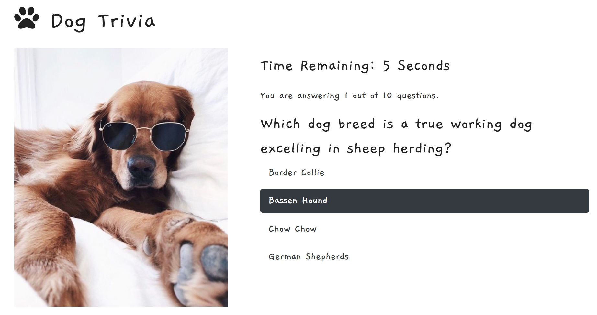
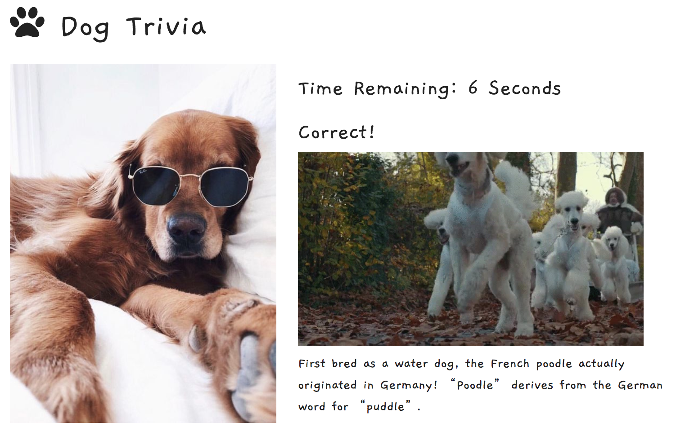
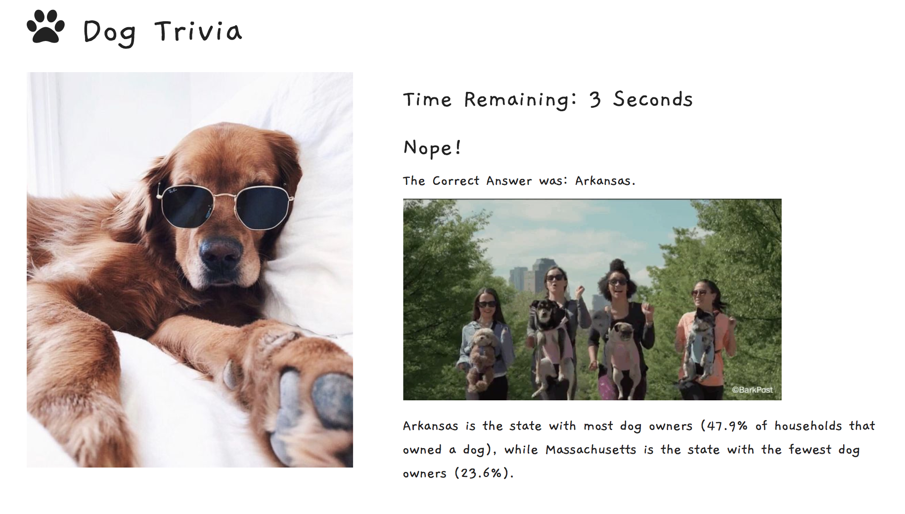
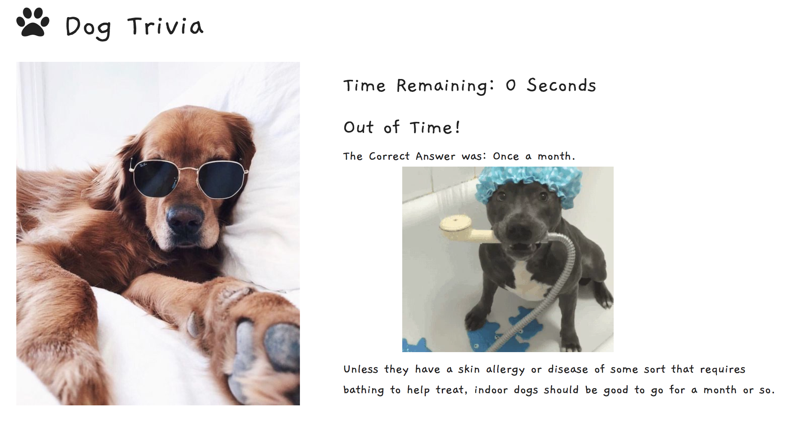
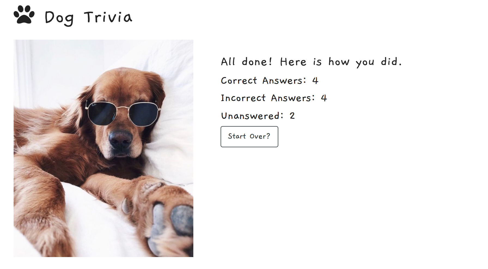

# Trivia Game

I created a dog-themed trivia game using JavaScript timing events for the logic and jQuery to manipulate HTML.
 [Click to Play](https://keenwilson.github.io/TriviaGame/ "Dog Trivia Game")

---
## How This Application Works

* A trivia game shows only one question until the player answers it or their time runs out (10 seconds per question).

* If the player selects the correct answer, it shows a screen congratulating them for choosing the right option. After a few seconds, it will move to the next question with no user input at all.

* The scenario is similar for incorrect answers and time-outs.

    
    * If the player chooses the wrong answer, it tells the player they selected the wrong option and then display the correct answer. Wait a few seconds, then display the next question.
    
    
    * If the player runs out of time, it tells the player that time's up and display the correct answer. Wait a few seconds, then display the next question.

* On the final screen, show the number of correct answer, incorrect answers, and an option to restart the game (without reloading the page).

---
## Technology and concept used
* JavaScript Timer
* jQuery
* CSS Bootstrap

---
## Author

[Keen Wilson](https://github.com/keenwilson/keenwilson.github.io "Keen Wilson's Portfolio")

